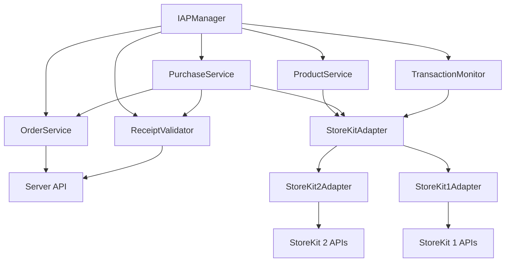

# Design Document

## Overview

Swift IAP Framework is a modern in-app purchase framework designed to provide comprehensive, secure, and easy-to-use IAP functionality for iOS applications. The framework adopts a protocol-oriented design, supports iOS 13+ systems, uses Swift 6.0+ and Swift Concurrency, while being compatible with both StoreKit 1 and StoreKit 2 APIs. The framework is distributed as a Swift Package, has no external third-party dependencies, and supports both UIKit and SwiftUI frameworks.

### Core Design Principles

1. **Version Compatibility**: Runtime system version detection, automatically selecting the most suitable StoreKit API
2. **Concurrency Safety**: Comprehensive use of Swift Concurrency, enabling strict concurrency checking to ensure thread safety
3. **Anti-Loss Design**: Continuous monitoring of transaction queues, implementing intelligent retry mechanisms to ensure no purchases are missed
4. **Protocol Abstraction**: Using protocols to define core interfaces, facilitating testing and extension
5. **Modular Architecture**: Clear separation of responsibilities, facilitating maintenance and testing
6. **Multi-Product Type Support**: Full support for consumable, non-consumable, and subscription products
7. **Localization Support**: Complete multi-language error messages and user prompts
8. **Zero Dependencies**: No external third-party library dependencies, keeping the framework lightweight

## Architecture

### 整体架构图

```
┌─────────────────────────────────────────────────────────────┐
│                    Client Layer                             │
│  ┌─────────────────┐    ┌─────────────────────────────────┐ │
│  │   UIKit App     │    │      SwiftUI App                │ │
│  └─────────────────┘    └─────────────────────────────────┘ │
└─────────────────────────────────────────────────────────────┘
                              │
┌─────────────────────────────────────────────────────────────┐
│                  Public API Layer                          │
│  ┌─────────────────────────────────────────────────────────┐ │
│  │              IAPManager (Singleton)                     │ │
│  └─────────────────────────────────────────────────────────┘ │
└─────────────────────────────────────────────────────────────┘
                              │
┌─────────────────────────────────────────────────────────────┐
│                 Service Layer                               │
│  ┌──────────────┐ ┌──────────────┐ ┌─────────────────────┐  │
│  │   Product    │ │  Purchase    │ │   Transaction       │  │
│  │   Service    │ │   Service    │ │   Monitor           │  │
│  └──────────────┘ └──────────────┘ └─────────────────────┘  │
│  ┌──────────────┐ ┌──────────────┐                        │
│  │    Order     │ │   Receipt    │                        │
│  │   Service    │ │  Validator   │                        │
│  └──────────────┘ └──────────────┘                        │
└─────────────────────────────────────────────────────────────┘
                              │
┌─────────────────────────────────────────────────────────────┐
│                Platform Adapter Layer                      │
│  ┌──────────────────┐    ┌──────────────────────────────┐   │
│  │  StoreKit 2      │    │     StoreKit 1               │   │
│  │  Adapter         │    │     Adapter                  │   │
│  │  (iOS 15+)       │    │     (iOS 13-14)              │   │
│  └──────────────────┘    └──────────────────────────────┘   │
└─────────────────────────────────────────────────────────────┘
                              │
┌─────────────────────────────────────────────────────────────┐
│                 System Layer                               │
│  ┌──────────────────┐    ┌──────────────────────────────┐   │
│  │    StoreKit 2    │    │      StoreKit 1              │   │
│  │   (iOS 15+)      │    │     (iOS 13-14)              │   │
│  └──────────────────┘    └──────────────────────────────┘   │
│  ┌─────────────────────────────────────────────────────────┐ │
│  │              Server API Layer                          │ │
│  │  ┌─────────────────┐    ┌─────────────────────────────┐ │ │
│  │  │  Order Creation │    │   Receipt Validation       │ │ │
│  │  │     API         │    │        API                 │ │ │
│  │  └─────────────────┘    └─────────────────────────────┘ │ │
│  └─────────────────────────────────────────────────────────┘ │
└─────────────────────────────────────────────────────────────┘
```

### Core Component Relationships



## Components and Interfaces

### 1. Core Protocol Definitions

#### IAPManagerProtocol
```swift
@MainActor
protocol IAPManagerProtocol: Sendable {
    func loadProducts(productIDs: Set<String>) async throws -> [IAPProduct]
    func purchase(_ product: IAPProduct, userInfo: [String: Any]?) async throws -> IAPPurchaseResult
    func restorePurchases() async throws -> [IAPTransaction]
    func validateReceipt(_ receiptData: Data, with order: IAPOrder) async throws -> IAPReceiptValidationResult
    
    // Order management
    func createOrder(for product: IAPProduct, userInfo: [String: Any]?) async throws -> IAPOrder
    func queryOrderStatus(_ orderID: String) async throws -> IAPOrderStatus
    
    // Configuration and state management
    func configure(with configuration: IAPConfiguration) async
    var currentState: IAPState { get async }
}
```

#### StoreKitAdapterProtocol
```swift
protocol StoreKitAdapterProtocol: Sendable {
    func loadProducts(productIDs: Set<String>) async throws -> [IAPProduct]
    func purchase(_ product: IAPProduct) async throws -> IAPPurchaseResult
    func restorePurchases() async throws -> [IAPTransaction]
    func startTransactionObserver() async
    func stopTransactionObserver()
    
    // Version-specific functionality
    var supportedProductTypes: Set<IAPProductType> { get }
    var isAvailable: Bool { get async }
}
```

#### ReceiptValidatorProtocol
```swift
protocol ReceiptValidatorProtocol: Sendable {
    func validateReceipt(_ receiptData: Data) async throws -> IAPReceiptValidationResult
    func validateReceipt(_ receiptData: Data, with order: IAPOrder) async throws -> IAPReceiptValidationResult
    func validateReceipt(_ receiptData: Data, remotely: Bool) async throws -> IAPReceiptValidationResult
}
```

#### OrderServiceProtocol
```swift
protocol OrderServiceProtocol: Sendable {
    func createOrder(for product: IAPProduct, userInfo: [String: Any]?) async throws -> IAPOrder
    func queryOrderStatus(_ orderID: String) async throws -> IAPOrderStatus
    func updateOrderStatus(_ orderID: String, status: IAPOrderStatus) async throws
    func cancelOrder(_ orderID: String) async throws
    
    // Order cleanup and recovery
    func cleanupExpiredOrders() async throws
    func recoverPendingOrders() async throws -> [IAPOrder]
}
```

### 2. Data Models

#### IAPProduct
```swift
struct IAPProduct: Sendable, Identifiable, Equatable {
    let id: String
    let displayName: String
    let description: String
    let price: Decimal
    let priceLocale: Locale
    let productType: IAPProductType
    let subscriptionInfo: IAPSubscriptionInfo?
    
    // Localized price display
    var localizedPrice: String {
        let formatter = NumberFormatter()
        formatter.numberStyle = .currency
        formatter.locale = priceLocale
        return formatter.string(from: price as NSDecimalNumber) ?? ""
    }
}

enum IAPProductType: String, Sendable, CaseIterable {
    case consumable
    case nonConsumable
    case autoRenewableSubscription
    case nonRenewingSubscription
}

struct IAPSubscriptionInfo: Sendable, Equatable {
    let subscriptionGroupID: String
    let subscriptionPeriod: IAPSubscriptionPeriod
    let introductoryPrice: IAPSubscriptionOffer?
    let promotionalOffers: [IAPSubscriptionOffer]
}
```

#### IAPTransaction
```swift
struct IAPTransaction: Sendable, Identifiable, Equatable {
    let id: String
    let productID: String
    let purchaseDate: Date
    let transactionState: IAPTransactionState
    let receiptData: Data?
    let originalTransactionID: String?
    let quantity: Int
    
    // Priority for anti-loss mechanism
    var priority: Int {
        switch transactionState {
        case .purchasing: return 3
        case .purchased: return 2
        case .restored: return 1
        case .failed, .deferred: return 0
        }
    }
}

enum IAPTransactionState: Sendable, Equatable {
    case purchasing
    case purchased
    case failed(IAPError)
    case restored
    case deferred
}

enum IAPPurchaseResult: Sendable, Equatable {
    case success(IAPTransaction, IAPOrder)
    case pending(IAPTransaction, IAPOrder)
    case cancelled(IAPOrder?)
    case failed(IAPError, IAPOrder?)
}

#### IAPOrder
```swift
struct IAPOrder: Sendable, Identifiable, Equatable {
    let id: String
    let productID: String
    let userInfo: [String: Any]?
    let createdAt: Date
    let expiresAt: Date?
    let status: IAPOrderStatus
    let serverOrderID: String?
    
    // Order metadata
    let amount: Decimal?
    let currency: String?
    let userID: String?
    
    var isExpired: Bool {
        guard let expiresAt = expiresAt else { return false }
        return Date() > expiresAt
    }
    
    var isActive: Bool {
        switch status {
        case .created, .pending:
            return !isExpired
        case .completed, .cancelled, .failed:
            return false
        }
    }
}

enum IAPOrderStatus: String, Sendable, CaseIterable {
    case created = "created"
    case pending = "pending"
    case completed = "completed"
    case cancelled = "cancelled"
    case failed = "failed"
    
    var isTerminal: Bool {
        switch self {
        case .completed, .cancelled, .failed:
            return true
        case .created, .pending:
            return false
        }
    }
}
```

### 3. Service Layer Components

#### ProductService
Responsible for loading and managing product information, supporting multiple product types:
```swift
@MainActor
final class ProductService: Sendable {
    private let adapter: StoreKitAdapterProtocol
    private let cache: IAPCache
    
    func loadProducts(productIDs: Set<String>) async throws -> [IAPProduct]
    func getProduct(by id: String) -> IAPProduct?
    func clearCache()
    
    // Support for special handling of different product types
    func loadConsumableProducts(productIDs: Set<String>) async throws -> [IAPProduct]
    func loadSubscriptionProducts(productIDs: Set<String>) async throws -> [IAPProduct]
    func loadNonConsumableProducts(productIDs: Set<String>) async throws -> [IAPProduct]
}
```

#### PurchaseService
Handles purchase flows for all product types with server-side order management:
```swift
@MainActor
final class PurchaseService: Sendable {
    private let adapter: StoreKitAdapterProtocol
    private let validator: ReceiptValidatorProtocol
    private let orderService: OrderServiceProtocol
    private let retryManager: RetryManager
    
    func purchase(_ product: IAPProduct, userInfo: [String: Any]?) async throws -> IAPPurchaseResult
    func restorePurchases() async throws -> [IAPTransaction]
    
    // New order-based purchase flow
    private func executeOrderBasedPurchase(_ product: IAPProduct, userInfo: [String: Any]?) async throws -> IAPPurchaseResult
    private func createOrderAndPurchase(_ product: IAPProduct, userInfo: [String: Any]?) async throws -> (IAPOrder, IAPTransaction)
    private func validatePurchaseWithOrder(_ transaction: IAPTransaction, order: IAPOrder) async throws -> IAPPurchaseResult
    
    // Support for purchase handling of different product types
    private func handleConsumablePurchase(_ product: IAPProduct, order: IAPOrder) async throws -> IAPPurchaseResult
    private func handleNonConsumablePurchase(_ product: IAPProduct, order: IAPOrder) async throws -> IAPPurchaseResult
    private func handleSubscriptionPurchase(_ product: IAPProduct, order: IAPOrder) async throws -> IAPPurchaseResult
    
    // Order cleanup and error handling
    private func handlePurchaseFailure(_ error: Error, order: IAPOrder?) async
    private func cleanupFailedOrder(_ order: IAPOrder) async
}
```

#### OrderService
Manages server-side order creation and tracking:
```swift
@MainActor
final class OrderService: OrderServiceProtocol {
    private let networkClient: NetworkClient
    private let cache: IAPCache
    private let retryManager: RetryManager
    
    func createOrder(for product: IAPProduct, userInfo: [String: Any]?) async throws -> IAPOrder {
        // 1. Create local order record
        let localOrder = createLocalOrder(for: product, userInfo: userInfo)
        
        // 2. Send order creation request to server
        let serverResponse = try await sendOrderCreationRequest(localOrder)
        
        // 3. Update local order with server response
        let finalOrder = updateOrderWithServerResponse(localOrder, response: serverResponse)
        
        // 4. Cache the order
        await cache.storeOrder(finalOrder)
        
        return finalOrder
    }
    
    func queryOrderStatus(_ orderID: String) async throws -> IAPOrderStatus {
        // First check local cache
        if let cachedOrder = await cache.getOrder(orderID) {
            // If order is terminal, return cached status
            if cachedOrder.status.isTerminal {
                return cachedOrder.status
            }
        }
        
        // Query server for latest status
        let serverStatus = try await queryServerOrderStatus(orderID)
        
        // Update local cache
        await cache.updateOrderStatus(orderID, status: serverStatus)
        
        return serverStatus
    }
    
    func updateOrderStatus(_ orderID: String, status: IAPOrderStatus) async throws {
        try await sendOrderStatusUpdate(orderID, status: status)
        await cache.updateOrderStatus(orderID, status: status)
    }
    
    func cancelOrder(_ orderID: String) async throws {
        try await updateOrderStatus(orderID, status: .cancelled)
    }
    
    func cleanupExpiredOrders() async throws {
        let expiredOrders = await cache.getExpiredOrders()
        for order in expiredOrders {
            try await cancelOrder(order.id)
            await cache.removeOrder(order.id)
        }
    }
    
    func recoverPendingOrders() async throws -> [IAPOrder] {
        let pendingOrders = await cache.getPendingOrders()
        var recoveredOrders: [IAPOrder] = []
        
        for order in pendingOrders {
            do {
                let currentStatus = try await queryOrderStatus(order.id)
                if currentStatus != order.status {
                    let updatedOrder = order.withStatus(currentStatus)
                    await cache.storeOrder(updatedOrder)
                    recoveredOrders.append(updatedOrder)
                }
            } catch {
                IAPLogger.debug("Failed to recover order \(order.id): \(error)")
            }
        }
        
        return recoveredOrders
    }
    
    // Private helper methods
    private func createLocalOrder(for product: IAPProduct, userInfo: [String: Any]?) -> IAPOrder
    private func sendOrderCreationRequest(_ order: IAPOrder) async throws -> OrderCreationResponse
    private func updateOrderWithServerResponse(_ order: IAPOrder, response: OrderCreationResponse) -> IAPOrder
    private func queryServerOrderStatus(_ orderID: String) async throws -> IAPOrderStatus
    private func sendOrderStatusUpdate(_ orderID: String, status: IAPOrderStatus) async throws
}
```

#### TransactionMonitor
Real-time monitoring of transaction state changes, implementing anti-loss mechanisms:
```swift
@MainActor
final class TransactionMonitor: Sendable {
    private let adapter: StoreKitAdapterProtocol
    private let recoveryManager: TransactionRecoveryManager
    private var isMonitoring = false
    
    func startMonitoring() async
    func stopMonitoring()
    func handlePendingTransactions() async
    
    // Core anti-loss functionality
    func monitorTransactionQueue() async
    func handleUnfinishedTransactions() async
    private func processTransactionUpdate(_ transaction: IAPTransaction) async
}
```

### 4. Platform Adapter Layer

#### StoreKitAdapterFactory
Runtime version detection and adapter selection:
```swift
final class StoreKitAdapterFactory {
    static func createAdapter() -> StoreKitAdapterProtocol {
        if #available(iOS 15.0, *) {
            return StoreKit2Adapter()
        } else {
            return StoreKit1Adapter()
        }
    }
    
    static var currentSystemVersion: String {
        UIDevice.current.systemVersion
    }
    
    static var isStoreKit2Available: Bool {
        if #available(iOS 15.0, *) {
            return true
        }
        return false
    }
}
```

#### StoreKit2Adapter (iOS 15+)
Uses modern StoreKit 2 API, supporting all product types:
```swift
final class StoreKit2Adapter: StoreKitAdapterProtocol {
    private var transactionListener: Task<Void, Error>?
    
    var supportedProductTypes: Set<IAPProductType> {
        [.consumable, .nonConsumable, .autoRenewableSubscription, .nonRenewingSubscription]
    }
    
    func loadProducts(productIDs: Set<String>) async throws -> [IAPProduct] {
        let products = try await Product.products(for: productIDs)
        return products.map { convertToIAPProduct($0) }
    }
    
    func purchase(_ product: IAPProduct) async throws -> IAPPurchaseResult {
        guard let storeProduct = await findStoreProduct(for: product.id) else {
            throw IAPError.productNotFound
        }
        
        let result = try await storeProduct.purchase()
        return try await handlePurchaseResult(result)
    }
    
    func startTransactionObserver() async {
        transactionListener = listenForTransactions()
    }
    
    private func listenForTransactions() -> Task<Void, Error> {
        Task.detached {
            for await result in Transaction.updates {
                await self.handleTransactionUpdate(result)
            }
        }
    }
}
```

#### StoreKit1Adapter (iOS 13-14)
Uses traditional StoreKit 1 API, converting to async/await through withCheckedContinuation:
```swift
final class StoreKit1Adapter: NSObject, StoreKitAdapterProtocol {
    private var productRequestContinuations: [String: CheckedContinuation<[IAPProduct], Error>] = [:]
    private var purchaseContinuations: [String: CheckedContinuation<IAPPurchaseResult, Error>] = [:]
    
    var supportedProductTypes: Set<IAPProductType> {
        [.consumable, .nonConsumable, .autoRenewableSubscription, .nonRenewingSubscription]
    }
    
    func loadProducts(productIDs: Set<String>) async throws -> [IAPProduct] {
        return try await withCheckedThrowingContinuation { continuation in
            let requestID = UUID().uuidString
            productRequestContinuations[requestID] = continuation
            
            let request = SKProductsRequest(productIdentifiers: productIDs)
            request.delegate = self
            request.start()
        }
    }
    
    func purchase(_ product: IAPProduct) async throws -> IAPPurchaseResult {
        return try await withCheckedThrowingContinuation { continuation in
            purchaseContinuations[product.id] = continuation
            
            let payment = SKPayment(product: findSKProduct(for: product.id))
            SKPaymentQueue.default().add(payment)
        }
    }
    
    func startTransactionObserver() async {
        SKPaymentQueue.default().add(self)
    }
    
    func stopTransactionObserver() {
        SKPaymentQueue.default().remove(self)
    }
}

// MARK: - SKProductsRequestDelegate
extension StoreKit1Adapter: SKProductsRequestDelegate {
    func productsRequest(_ request: SKProductsRequest, didReceive response: SKProductsResponse) {
        let products = response.products.map { convertToIAPProduct($0) }
        // Complete the corresponding continuation
    }
}

// MARK: - SKPaymentTransactionObserver
extension StoreKit1Adapter: SKPaymentTransactionObserver {
    func paymentQueue(_ queue: SKPaymentQueue, updatedTransactions transactions: [SKPaymentTransaction]) {
        for transaction in transactions {
            handleSKTransaction(transaction)
        }
    }
}
```

## Data Models

### Error Handling Model

```swift
enum IAPError: LocalizedError, Sendable {
    case productNotFound
    case purchaseCancelled
    case purchaseFailed(underlying: Error)
    case receiptValidationFailed
    case networkError
    case unknownError
    
    var errorDescription: String? {
        switch self {
        case .productNotFound:
            return IAPUserMessage.productNotFound.localizedString
        case .purchaseCancelled:
            return IAPUserMessage.purchaseCancelled.localizedString
        // ... other errors
        }
    }
}
```

### Localization Support

```swift
enum IAPUserMessage: String, CaseIterable {
    case productNotFound = "product_not_found"
    case purchaseCancelled = "purchase_cancelled"
    case purchaseSuccessful = "purchase_successful"
    case restoreSuccessful = "restore_successful"
    
    var localizedString: String {
        NSLocalizedString(self.rawValue, bundle: .module, comment: "")
    }
}

enum IAPDebugMessage: String {
    case loadingProducts = "Loading products with IDs: %@"
    case purchaseStarted = "Purchase started for product: %@"
    case transactionUpdated = "Transaction updated: %@"
}
```

## Error Handling

### Error Handling Strategy

1. **Layered Error Handling**: Each layer has clear error handling responsibilities
2. **Error Transformation**: Converting system errors to user-friendly errors
3. **Retry Mechanism**: Implementing exponential backoff retry for network and temporary errors
4. **Error Logging**: Detailed error information logging for debugging
5. **Localization Support**: All user-visible errors support multiple languages

### Error Type Definitions

```swift
enum IAPError: LocalizedError, Sendable, Equatable {
    case productNotFound
    case purchaseCancelled
    case purchaseFailed(underlying: String)
    case receiptValidationFailed
    case networkError
    case storeKitNotAvailable
    case invalidProductType
    case transactionNotFound
    case configurationError
    case unknownError
    
    // Order-related errors
    case orderCreationFailed(underlying: String)
    case orderNotFound
    case orderExpired
    case orderAlreadyCompleted
    case orderValidationFailed
    case serverOrderMismatch
    
    var errorDescription: String? {
        switch self {
        case .productNotFound:
            return IAPUserMessage.productNotFound.localizedString
        case .purchaseCancelled:
            return IAPUserMessage.purchaseCancelled.localizedString
        case .purchaseFailed:
            return IAPUserMessage.purchaseFailed.localizedString
        case .receiptValidationFailed:
            return IAPUserMessage.receiptValidationFailed.localizedString
        case .networkError:
            return IAPUserMessage.networkError.localizedString
        case .storeKitNotAvailable:
            return IAPUserMessage.storeKitNotAvailable.localizedString
        case .invalidProductType:
            return IAPUserMessage.invalidProductType.localizedString
        case .transactionNotFound:
            return IAPUserMessage.transactionNotFound.localizedString
        case .configurationError:
            return IAPUserMessage.configurationError.localizedString
        case .unknownError:
            return IAPUserMessage.unknownError.localizedString
        case .orderCreationFailed:
            return IAPUserMessage.orderCreationFailed.localizedString
        case .orderNotFound:
            return IAPUserMessage.orderNotFound.localizedString
        case .orderExpired:
            return IAPUserMessage.orderExpired.localizedString
        case .orderAlreadyCompleted:
            return IAPUserMessage.orderAlreadyCompleted.localizedString
        case .orderValidationFailed:
            return IAPUserMessage.orderValidationFailed.localizedString
        case .serverOrderMismatch:
            return IAPUserMessage.serverOrderMismatch.localizedString
        }
    }
    
    var recoverySuggestion: String? {
        switch self {
        case .networkError:
            return IAPUserMessage.networkErrorRecovery.localizedString
        case .storeKitNotAvailable:
            return IAPUserMessage.storeKitNotAvailableRecovery.localizedString
        default:
            return nil
        }
    }
}
```

### Retry Mechanism Design

```swift
actor RetryManager {
    private var retryAttempts: [String: Int] = [:]
    private let maxRetries = 3
    private let baseDelay: TimeInterval = 1.0
    
    func shouldRetry(for operation: String) -> Bool {
        let attempts = retryAttempts[operation, default: 0]
        return attempts < maxRetries
    }
    
    func recordAttempt(for operation: String) {
        retryAttempts[operation, default: 0] += 1
    }
    
    func getDelay(for operation: String) async -> TimeInterval {
        let attempts = retryAttempts[operation, default: 0]
        let delay = baseDelay * pow(2.0, Double(attempts)) // Exponential backoff
        
        // Actual delay execution
        try? await Task.sleep(nanoseconds: UInt64(delay * 1_000_000_000))
        return delay
    }
    
    func reset(for operation: String) {
        retryAttempts.removeValue(forKey: operation)
    }
    
    func resetAll() {
        retryAttempts.removeAll()
    }
}
```

### Localization Message System

```swift
enum IAPUserMessage: String, CaseIterable {
    case productNotFound = "product_not_found"
    case purchaseCancelled = "purchase_cancelled"
    case purchaseFailed = "purchase_failed"
    case purchaseSuccessful = "purchase_successful"
    case restoreSuccessful = "restore_successful"
    case receiptValidationFailed = "receipt_validation_failed"
    case networkError = "network_error"
    case networkErrorRecovery = "network_error_recovery"
    case storeKitNotAvailable = "storekit_not_available"
    case storeKitNotAvailableRecovery = "storekit_not_available_recovery"
    case invalidProductType = "invalid_product_type"
    case transactionNotFound = "transaction_not_found"
    case configurationError = "configuration_error"
    case unknownError = "unknown_error"
    
    // Order-related messages
    case orderCreationFailed = "order_creation_failed"
    case orderNotFound = "order_not_found"
    case orderExpired = "order_expired"
    case orderAlreadyCompleted = "order_already_completed"
    case orderValidationFailed = "order_validation_failed"
    case serverOrderMismatch = "server_order_mismatch"
    
    var localizedString: String {
        NSLocalizedString(self.rawValue, bundle: .module, comment: "")
    }
}

enum IAPDebugMessage: String {
    case loadingProducts = "Loading products with IDs: %@"
    case purchaseStarted = "Purchase started for product: %@"
    case transactionUpdated = "Transaction updated: %@"
    case retryAttempt = "Retry attempt %d for operation: %@"
    case adapterSelected = "Selected adapter: %@ for iOS %@"
}
```

## Testing Strategy

### Testing Architecture

1. **Protocol Abstraction**: All core components are based on protocols, facilitating Mock and testing
2. **Dependency Injection**: Injecting dependencies through constructors, supporting implementation replacement during testing
3. **Asynchronous Testing**: Comprehensive use of Swift Concurrency testing features
4. **Mock Objects**: Providing complete Mock implementations covering all test scenarios
5. **Testing Tools**: Providing test data generators and state verification tools
6. **Edge Case Testing**: Covering complex scenarios like network interruptions and application crashes

### Complete Mock Implementation

```swift
final class MockStoreKitAdapter: StoreKitAdapterProtocol {
    var mockProducts: [IAPProduct] = []
    var mockPurchaseResult: IAPPurchaseResult?
    var mockRestoreResults: [IAPTransaction] = []
    var mockError: Error?
    var shouldSimulateDelay = false
    var delayDuration: TimeInterval = 0.1
    
    var supportedProductTypes: Set<IAPProductType> {
        [.consumable, .nonConsumable, .autoRenewableSubscription]
    }
    
    var isAvailable: Bool {
        get async { mockError == nil }
    }
    
    func loadProducts(productIDs: Set<String>) async throws -> [IAPProduct] {
        if shouldSimulateDelay {
            try await Task.sleep(nanoseconds: UInt64(delayDuration * 1_000_000_000))
        }
        
        if let error = mockError {
            throw error
        }
        
        return mockProducts.filter { productIDs.contains($0.id) }
    }
    
    func purchase(_ product: IAPProduct) async throws -> IAPPurchaseResult {
        if shouldSimulateDelay {
            try await Task.sleep(nanoseconds: UInt64(delayDuration * 1_000_000_000))
        }
        
        if let error = mockError {
            throw error
        }
        
        return mockPurchaseResult ?? .success(createMockTransaction(for: product))
    }
    
    func restorePurchases() async throws -> [IAPTransaction] {
        if let error = mockError {
            throw error
        }
        return mockRestoreResults
    }
    
    func startTransactionObserver() async {
        // Mock implementation
    }
    
    func stopTransactionObserver() {
        // Mock implementation
    }
}

final class MockReceiptValidator: ReceiptValidatorProtocol {
    var mockValidationResult: IAPReceiptValidationResult?
    var mockError: Error?
    var shouldValidateRemotely = false
    
    func validateReceipt(_ receiptData: Data) async throws -> IAPReceiptValidationResult {
        if let error = mockError {
            throw error
        }
        return mockValidationResult ?? .valid(transactions: [])
    }
    
    func validateReceipt(_ receiptData: Data, remotely: Bool) async throws -> IAPReceiptValidationResult {
        shouldValidateRemotely = remotely
        return try await validateReceipt(receiptData)
    }
}
```

### Test Case Design

```swift
final class IAPManagerTests: XCTestCase {
    private var sut: IAPManager!
    private var mockAdapter: MockStoreKitAdapter!
    private var mockValidator: MockReceiptValidator!
    
    override func setUp() async throws {
        mockAdapter = MockStoreKitAdapter()
        mockValidator = MockReceiptValidator()
        sut = IAPManager(
            adapter: mockAdapter,
            validator: mockValidator
        )
    }
    
    func testLoadProducts_AllProductTypes_Success() async throws {
        // Given
        let consumableProduct = TestDataGenerator.createProduct(type: .consumable)
        let nonConsumableProduct = TestDataGenerator.createProduct(type: .nonConsumable)
        let subscriptionProduct = TestDataGenerator.createProduct(type: .autoRenewableSubscription)
        
        mockAdapter.mockProducts = [consumableProduct, nonConsumableProduct, subscriptionProduct]
        
        // When
        let products = try await sut.loadProducts(productIDs: [
            consumableProduct.id, nonConsumableProduct.id, subscriptionProduct.id
        ])
        
        // Then
        XCTAssertEqual(products.count, 3)
        XCTAssertTrue(products.contains { $0.productType == .consumable })
        XCTAssertTrue(products.contains { $0.productType == .nonConsumable })
        XCTAssertTrue(products.contains { $0.productType == .autoRenewableSubscription })
    }
    
    func testPurchase_WithRetry_Success() async throws {
        // Given
        let product = TestDataGenerator.createProduct()
        mockAdapter.mockError = IAPError.networkError
        
        // When & Then
        do {
            _ = try await sut.purchase(product)
            XCTFail("Should have thrown network error")
        } catch {
            XCTAssertEqual(error as? IAPError, .networkError)
        }
        
        // Reset error and retry
        mockAdapter.mockError = nil
        mockAdapter.mockPurchaseResult = .success(TestDataGenerator.createTransaction(for: product))
        
        let result = try await sut.purchase(product)
        if case .success(let transaction) = result {
            XCTAssertEqual(transaction.productID, product.id)
        } else {
            XCTFail("Expected success result")
        }
    }
}
```

### Anti-Loss Mechanism Testing

```swift
final class AntiLossMechanismTests: XCTestCase {
    func testTransactionRecovery_NetworkInterruption() async throws {
        // Given
        let mockAdapter = MockStoreKitAdapter()
        let recoveryManager = TransactionRecoveryManager(adapter: mockAdapter)
        
        // Simulate network interruption during purchase
        mockAdapter.mockError = IAPError.networkError
        mockAdapter.shouldSimulateDelay = true
        
        // When
        await recoveryManager.recoverPendingTransactions()
        
        // Then
        // Verify retry mechanism was triggered
        // Verify transactions were eventually processed
    }
    
    func testRetryMechanism_ExponentialBackoff() async throws {
        // Given
        let retryManager = RetryManager()
        let operation = "test_purchase"
        
        // When & Then
        XCTAssertTrue(await retryManager.shouldRetry(for: operation))
        await retryManager.recordAttempt(for: operation)
        
        let delay1 = await retryManager.getDelay(for: operation)
        await retryManager.recordAttempt(for: operation)
        
        let delay2 = await retryManager.getDelay(for: operation)
        
        // Verify exponential backoff
        XCTAssertGreaterThan(delay2, delay1)
    }
}
```

## Anti-Loss Mechanism Design

### Core Strategies

1. **Startup Check**: Automatically check unfinished transactions when application starts
2. **Continuous Monitoring**: Real-time monitoring of transaction queue state changes
3. **Intelligent Retry**: Implement exponential backoff retry mechanism for failed transactions
4. **State Persistence**: Persistent storage of critical state information
5. **Priority Processing**: Process transactions sorted by importance and time
6. **Network Recovery**: Automatically reprocess failed transactions after network recovery

### Implementation Details

```swift
@MainActor
final class TransactionRecoveryManager: Sendable {
    private let adapter: StoreKitAdapterProtocol
    private let retryManager: RetryManager
    private let cache: IAPCache
    
    func recoverPendingTransactions() async {
        IAPLogger.debug("Starting transaction and order recovery process")
        
        // 1. First recover pending orders
        await recoverPendingOrders()
        
        // 2. Get all unfinished transactions
        let pendingTransactions = await getPendingTransactions()
        
        // 3. Sort by priority (purchasing transactions have highest priority)
        let sortedTransactions = pendingTransactions.sorted { 
            if $0.priority != $1.priority {
                return $0.priority > $1.priority
            }
            return $0.purchaseDate < $1.purchaseDate
        }
        
        IAPLogger.debug("Found \(sortedTransactions.count) pending transactions")
        
        // 4. Process one by one
        for transaction in sortedTransactions {
            await processTransaction(transaction)
        }
    }
    
    private func recoverPendingOrders() async {
        do {
            let recoveredOrders = try await orderService.recoverPendingOrders()
            IAPLogger.debug("Recovered \(recoveredOrders.count) pending orders")
            
            // Handle orders that need cleanup
            for order in recoveredOrders {
                if order.status.isTerminal && order.status != .completed {
                    await handleFailedOrder(order)
                }
            }
        } catch {
            IAPLogger.debug("Failed to recover pending orders: \(error)")
        }
    }
    
    private func handleFailedOrder(_ order: IAPOrder) async {
        // Clean up failed orders and notify if needed
        await cache.removeOrder(order.id)
        
        // Send notification about failed order
        NotificationCenter.default.post(
            name: .iapOrderRecoveryFailed,
            object: order
        )
    }
    
    private func processTransaction(_ transaction: IAPTransaction) async {
        let operationKey = "recover_\(transaction.id)"
        
        guard await retryManager.shouldRetry(for: operationKey) else {
            IAPLogger.debug("Max retries reached for transaction: \(transaction.id)")
            return
        }
        
        do {
            // Get delay time and wait
            _ = await retryManager.getDelay(for: operationKey)
            await retryManager.recordAttempt(for: operationKey)
            
            // Try to complete transaction
            try await completeTransaction(transaction)
            
            // Reset retry count after success
            await retryManager.reset(for: operationKey)
            IAPLogger.debug("Successfully recovered transaction: \(transaction.id)")
            
        } catch {
            IAPLogger.debug("Failed to recover transaction \(transaction.id): \(error)")
            
            // If can still retry, schedule next retry
            if await retryManager.shouldRetry(for: operationKey) {
                await scheduleRetry(for: transaction, error: error)
            } else {
                // Reached maximum retry count, record failure
                await handlePermanentFailure(transaction, error: error)
            }
        }
    }
    
    private func completeTransaction(_ transaction: IAPTransaction) async throws {
        switch transaction.transactionState {
        case .purchasing:
            // Wait for purchase completion
            try await waitForPurchaseCompletion(transaction)
        case .purchased:
            // Validate receipt and finish transaction
            try await validateAndFinishTransaction(transaction)
        case .restored:
            // Process restored transaction
            try await processRestoredTransaction(transaction)
        case .failed, .deferred:
            // Clean up failed or deferred transactions
            await cleanupFailedTransaction(transaction)
        }
    }
    
    private func scheduleRetry(for transaction: IAPTransaction, error: Error) async {
        // Mark transaction for retry
        await cache.markForRetry(transaction, error: error)
        
        // Send retry notification
        NotificationCenter.default.post(
            name: .iapTransactionRetryScheduled,
            object: transaction,
            userInfo: ["error": error]
        )
    }
    
    private func handlePermanentFailure(_ transaction: IAPTransaction, error: Error) async {
        IAPLogger.error("Permanent failure for transaction \(transaction.id): \(error)")
        
        // Mark as permanently failed
        await cache.markAsPermanentlyFailed(transaction, error: error)
        
        // Send failure notification
        NotificationCenter.default.post(
            name: .iapTransactionPermanentlyFailed,
            object: transaction,
            userInfo: ["error": error]
        )
    }
}
```

### Transaction State Persistence

```swift
actor IAPCache {
    private var pendingTransactions: [String: IAPTransaction] = [:]
    private var retryTransactions: [String: (transaction: IAPTransaction, error: Error, retryCount: Int)] = [:]
    private var failedTransactions: [String: (transaction: IAPTransaction, error: Error)] = [:]
    
    func storePendingTransaction(_ transaction: IAPTransaction) {
        pendingTransactions[transaction.id] = transaction
    }
    
    func removePendingTransaction(_ transactionID: String) {
        pendingTransactions.removeValue(forKey: transactionID)
        retryTransactions.removeValue(forKey: transactionID)
    }
    
    func markForRetry(_ transaction: IAPTransaction, error: Error) {
        let currentRetry = retryTransactions[transaction.id]?.retryCount ?? 0
        retryTransactions[transaction.id] = (transaction, error, currentRetry + 1)
    }
    
    func markAsPermanentlyFailed(_ transaction: IAPTransaction, error: Error) {
        failedTransactions[transaction.id] = (transaction, error)
        retryTransactions.removeValue(forKey: transaction.id)
        pendingTransactions.removeValue(forKey: transaction.id)
    }
    
    func getAllPendingTransactions() -> [IAPTransaction] {
        Array(pendingTransactions.values) + retryTransactions.values.map { $0.transaction }
    }
}
```

## Swift Package Integration Design

### Package.swift Configuration

```swift
// swift-tools-version: 6.0
import PackageDescription

let package = Package(
    name: "IAPFramework",
    platforms: [
        .iOS(.v13)
    ],
    products: [
        .library(
            name: "IAPFramework",
            targets: ["IAPFramework"]
        ),
    ],
    dependencies: [
        // No external dependencies, keeping framework lightweight
    ],
    targets: [
        .target(
            name: "IAPFramework",
            dependencies: [],
            swiftSettings: [
                .enableExperimentalFeature("StrictConcurrency")
            ]
        ),
        .testTarget(
            name: "IAPFrameworkTests",
            dependencies: ["IAPFramework"]
        ),
    ]
)
```

### Public API Design

The framework provides a clean public interface, hiding internal complexity:

```swift
// Main entry point
@MainActor
public final class IAPManager: ObservableObject {
    public static let shared = IAPManager()
    
    // Core functionality
    public func loadProducts(productIDs: Set<String>) async throws -> [IAPProduct]
    public func purchase(_ product: IAPProduct) async throws -> IAPPurchaseResult
    public func restorePurchases() async throws -> [IAPTransaction]
    
    // 配置和状态
    public func configure(with configuration: IAPConfiguration) async
    @Published public private(set) var currentState: IAPState = .idle
}

// UIKit 和 SwiftUI 兼容性
extension IAPManager {
    // UIKit 友好的回调接口
    public func loadProducts(
        productIDs: Set<String>
    ) async throws -> [IAPProduct] {
            do {
                let products = try await loadProducts(productIDs: productIDs)
                completion(.success(products))
            } catch {
                completion(.failure(error))
            }
        }
    }
}
```

## 平台兼容性设计

### UIKit 支持

```swift
// UIKit 示例实现
class UIKitIAPManager: NSObject {
    private let iapManager = IAPManager.shared
    
    func purchaseProduct(_ product: IAPProduct, from viewController: UIViewController) {
        Task { @MainActor in
            do {
                let result = try await iapManager.purchase(product)
                await handlePurchaseResult(result, in: viewController)
            } catch {
                await showError(error, in: viewController)
            }
        }
    }
    
    @MainActor
    private func handlePurchaseResult(_ result: IAPPurchaseResult, in viewController: UIViewController) {
        switch result {
        case .success(let transaction):
            showSuccessAlert(for: transaction, in: viewController)
        case .cancelled:
            // 用户取消，无需显示错误
            break
        case .failed(let error):
            showError(error, in: viewController)
        case .pending:
            showPendingAlert(in: viewController)
        }
    }
}
```

### SwiftUI 支持

```swift
// SwiftUI 示例实现
@MainActor
class SwiftUIIAPManager: ObservableObject {
    @Published var products: [IAPProduct] = []
    @Published var isLoading = false
    @Published var errorMessage: String?
    
    private let iapManager = IAPManager.shared
    
    func loadProducts(productIDs: Set<String>) {
        isLoading = true
        errorMessage = nil
        
        Task {
            do {
                let loadedProducts = try await iapManager.loadProducts(productIDs: productIDs)
                await MainActor.run {
                    self.products = loadedProducts
                    self.isLoading = false
                }
            } catch {
                await MainActor.run {
                    self.errorMessage = error.localizedDescription
                    self.isLoading = false
                }
            }
        }
    }
    
    func purchase(_ product: IAPProduct) {
        Task {
            do {
                let result = try await iapManager.purchase(product)
                await handlePurchaseResult(result)
            } catch {
                await MainActor.run {
                    self.errorMessage = error.localizedDescription
                }
            }
        }
    }
}
```

## 性能优化

### 缓存策略

1. **商品信息缓存**: 避免重复请求商品信息，支持缓存过期
2. **交易状态缓存**: 缓存交易状态减少查询，提高响应速度
3. **收据验证缓存**: 缓存验证结果，避免重复验证
4. **内存管理**: 及时释放不需要的资源，防止内存泄漏

### 并发优化

1. **Actor 隔离**: 使用 Actor 确保状态安全，避免数据竞争
2. **任务优先级**: 为不同操作设置合适的优先级
3. **批量操作**: 合并相似操作减少系统调用
4. **异步流**: 使用 AsyncSequence 处理连续的交易更新

### 启动优化

```swift
@MainActor
final class IAPStartupManager {
    static func initializeFramework() async {
        // 1. 检查 StoreKit 可用性
        guard await StoreKitAdapterFactory.createAdapter().isAvailable else {
            IAPLogger.warning("StoreKit not available")
            return
        }
        
        // 2. 启动交易监听
        await IAPManager.shared.startTransactionObserver()
        
        // 3. 恢复未完成交易（后台执行）
        Task(priority: .background) {
            await IAPManager.shared.recoverPendingTransactions()
        }
        
        // 4. 预加载常用商品（可选）
        if let preloadProductIDs = IAPConfiguration.current.preloadProductIDs {
            Task(priority: .utility) {
                try? await IAPManager.shared.loadProducts(productIDs: preloadProductIDs)
            }
        }
    }
}
```

## 设计决策说明

### 1. 协议导向设计
**决策**: 使用协议定义所有核心接口
**理由**: 提高可测试性，支持依赖注入，便于 Mock 和单元测试

### 2. Swift Concurrency 优先
**决策**: 全面使用 async/await，启用严格并发检查
**理由**: 现代化的异步编程模型，更好的类型安全和性能

### 3. 运行时版本检测
**决策**: 运行时检测 iOS 版本，自动选择 StoreKit API
**理由**: 支持 iOS 13+ 的广泛兼容性，同时利用新版本的优势

### 4. 单例 + 依赖注入混合模式
**决策**: 提供单例便于使用，同时支持依赖注入用于测试
**理由**: 平衡易用性和可测试性

### 5. 零外部依赖
**决策**: 不依赖任何第三方库
**理由**: 减少依赖冲突，保持框架轻量化，提高稳定性

### 6. 本地化优先
**决策**: 所有用户可见消息都支持本地化
**理由**: 提供更好的用户体验，支持国际化应用

这个设计文档提供了完整的架构蓝图，确保框架既能满足所有功能需求，又具有良好的可维护性、可测试性和性能表现。