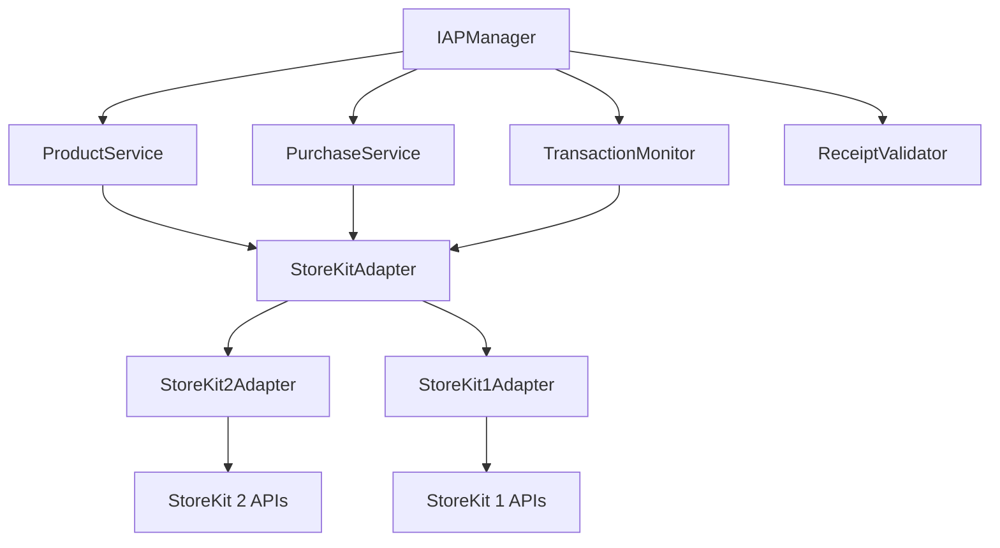

# Design Document

## Overview

Swift IAP Framework 是一个现代化的内购框架，旨在为 iOS 应用提供完整、安全、易用的内购功能。框架采用协议导向设计，支持 iOS 13+ 系统，使用 Swift 6.0+ 和 Swift Concurrency，同时兼容 StoreKit 1 和 StoreKit 2 API。

### 核心设计原则

1. **版本兼容性**: 运行时检测系统版本，自动选择最适合的 StoreKit API
2. **并发安全**: 全面使用 Swift Concurrency，确保线程安全
3. **防丢单设计**: 持续监听交易队列，确保不遗漏任何购买
4. **协议抽象**: 使用协议定义核心接口，便于测试和扩展
5. **模块化架构**: 清晰的职责分离，便于维护和测试

## Architecture

### 整体架构图

```
┌─────────────────────────────────────────────────────────────┐
│                    Client Layer                             │
│  ┌─────────────────┐    ┌─────────────────────────────────┐ │
│  │   UIKit App     │    │      SwiftUI App                │ │
│  └─────────────────┘    └─────────────────────────────────┘ │
└─────────────────────────────────────────────────────────────┘
                              │
┌─────────────────────────────────────────────────────────────┐
│                  Public API Layer                          │
│  ┌─────────────────────────────────────────────────────────┐ │
│  │              IAPManager (Singleton)                     │ │
│  └─────────────────────────────────────────────────────────┘ │
└─────────────────────────────────────────────────────────────┘
                              │
┌─────────────────────────────────────────────────────────────┐
│                 Service Layer                               │
│  ┌──────────────┐ ┌──────────────┐ ┌─────────────────────┐  │
│  │   Product    │ │  Purchase    │ │   Transaction       │  │
│  │   Service    │ │   Service    │ │   Monitor           │  │
│  └──────────────┘ └──────────────┘ └─────────────────────┘  │
└─────────────────────────────────────────────────────────────┘
                              │
┌─────────────────────────────────────────────────────────────┐
│                Platform Adapter Layer                      │
│  ┌──────────────────┐    ┌──────────────────────────────┐   │
│  │  StoreKit 2      │    │     StoreKit 1               │   │
│  │  Adapter         │    │     Adapter                  │   │
│  │  (iOS 15+)       │    │     (iOS 13-14)              │   │
│  └──────────────────┘    └──────────────────────────────┘   │
└─────────────────────────────────────────────────────────────┘
                              │
┌─────────────────────────────────────────────────────────────┐
│                 System Layer                               │
│  ┌──────────────────┐    ┌──────────────────────────────┐   │
│  │    StoreKit 2    │    │      StoreKit 1              │   │
│  │   (iOS 15+)      │    │     (iOS 13-14)              │   │
│  └──────────────────┘    └──────────────────────────────┘   │
└─────────────────────────────────────────────────────────────┘
```

### 核心组件关系



## Components and Interfaces

### 1. 核心协议定义

#### IAPManagerProtocol
```swift
@MainActor
protocol IAPManagerProtocol: Sendable {
    func loadProducts(productIDs: Set<String>) async throws -> [IAPProduct]
    func purchase(_ product: IAPProduct) async throws -> IAPPurchaseResult
    func restorePurchases() async throws -> [IAPTransaction]
    func validateReceipt(_ receiptData: Data) async throws -> IAPReceiptValidationResult
}
```

#### StoreKitAdapterProtocol
```swift
protocol StoreKitAdapterProtocol: Sendable {
    func loadProducts(productIDs: Set<String>) async throws -> [IAPProduct]
    func purchase(_ product: IAPProduct) async throws -> IAPPurchaseResult
    func restorePurchases() async throws -> [IAPTransaction]
    func startTransactionObserver() async
    func stopTransactionObserver()
}
```

### 2. 数据模型

#### IAPProduct
```swift
struct IAPProduct: Sendable, Identifiable {
    let id: String
    let displayName: String
    let description: String
    let price: Decimal
    let priceLocale: Locale
    let productType: IAPProductType
    let subscriptionInfo: IAPSubscriptionInfo?
}

enum IAPProductType: Sendable {
    case consumable
    case nonConsumable
    case autoRenewableSubscription
    case nonRenewingSubscription
}
```

#### IAPTransaction
```swift
struct IAPTransaction: Sendable, Identifiable {
    let id: String
    let productID: String
    let purchaseDate: Date
    let transactionState: IAPTransactionState
    let receiptData: Data?
    let originalTransactionID: String?
}

enum IAPTransactionState: Sendable {
    case purchasing
    case purchased
    case failed(IAPError)
    case restored
    case deferred
}
```

### 3. 服务层组件

#### ProductService
负责商品信息的加载和管理：
```swift
@MainActor
final class ProductService: Sendable {
    private let adapter: StoreKitAdapterProtocol
    private var cachedProducts: [String: IAPProduct] = [:]
    
    func loadProducts(productIDs: Set<String>) async throws -> [IAPProduct]
    func getProduct(by id: String) -> IAPProduct?
    func clearCache()
}
```

#### PurchaseService
处理购买流程：
```swift
@MainActor
final class PurchaseService: Sendable {
    private let adapter: StoreKitAdapterProtocol
    private let validator: ReceiptValidatorProtocol
    
    func purchase(_ product: IAPProduct) async throws -> IAPPurchaseResult
    func restorePurchases() async throws -> [IAPTransaction]
}
```

#### TransactionMonitor
监听和处理交易状态变化：
```swift
@MainActor
final class TransactionMonitor: Sendable {
    private let adapter: StoreKitAdapterProtocol
    private var isMonitoring = false
    
    func startMonitoring() async
    func stopMonitoring()
    func handlePendingTransactions() async
}
```

### 4. 平台适配层

#### StoreKit2Adapter (iOS 15+)
```swift
final class StoreKit2Adapter: StoreKitAdapterProtocol {
    func loadProducts(productIDs: Set<String>) async throws -> [IAPProduct] {
        let products = try await Product.products(for: productIDs)
        return products.map { convertToIAPProduct($0) }
    }
    
    func purchase(_ product: IAPProduct) async throws -> IAPPurchaseResult {
        guard let storeProduct = await findStoreProduct(for: product.id) else {
            throw IAPError.productNotFound
        }
        
        let result = try await storeProduct.purchase()
        return try await handlePurchaseResult(result)
    }
}
```

#### StoreKit1Adapter (iOS 13-14)
```swift
final class StoreKit1Adapter: NSObject, StoreKitAdapterProtocol {
    func loadProducts(productIDs: Set<String>) async throws -> [IAPProduct] {
        return try await withCheckedThrowingContinuation { continuation in
            let request = SKProductsRequest(productIdentifiers: productIDs)
            // 实现 SKProductsRequestDelegate
        }
    }
    
    func purchase(_ product: IAPProduct) async throws -> IAPPurchaseResult {
        return try await withCheckedThrowingContinuation { continuation in
            // 使用 SKPaymentQueue 实现购买
        }
    }
}
```

## Data Models

### 错误处理模型

```swift
enum IAPError: LocalizedError, Sendable {
    case productNotFound
    case purchaseCancelled
    case purchaseFailed(underlying: Error)
    case receiptValidationFailed
    case networkError
    case unknownError
    
    var errorDescription: String? {
        switch self {
        case .productNotFound:
            return IAPUserMessage.productNotFound.localizedString
        case .purchaseCancelled:
            return IAPUserMessage.purchaseCancelled.localizedString
        // ... 其他错误
        }
    }
}
```

### 本地化支持

```swift
enum IAPUserMessage: String, CaseIterable {
    case productNotFound = "product_not_found"
    case purchaseCancelled = "purchase_cancelled"
    case purchaseSuccessful = "purchase_successful"
    case restoreSuccessful = "restore_successful"
    
    var localizedString: String {
        NSLocalizedString(self.rawValue, bundle: .module, comment: "")
    }
}

enum IAPDebugMessage: String {
    case loadingProducts = "Loading products with IDs: %@"
    case purchaseStarted = "Purchase started for product: %@"
    case transactionUpdated = "Transaction updated: %@"
}
```

## Error Handling

### 错误处理策略

1. **分层错误处理**: 每层都有明确的错误处理责任
2. **错误转换**: 将系统错误转换为用户友好的错误
3. **重试机制**: 对网络错误和临时错误实现自动重试
4. **错误日志**: 详细记录错误信息用于调试

### 重试机制设计

```swift
actor RetryManager {
    private var retryAttempts: [String: Int] = [:]
    private let maxRetries = 3
    private let baseDelay: TimeInterval = 1.0
    
    func shouldRetry(for operation: String) -> Bool {
        let attempts = retryAttempts[operation, default: 0]
        return attempts < maxRetries
    }
    
    func recordAttempt(for operation: String) {
        retryAttempts[operation, default: 0] += 1
    }
    
    func getDelay(for operation: String) -> TimeInterval {
        let attempts = retryAttempts[operation, default: 0]
        return baseDelay * pow(2.0, Double(attempts)) // 指数退避
    }
}
```

## Testing Strategy

### 测试架构

1. **协议抽象**: 所有核心组件都基于协议，便于 Mock
2. **依赖注入**: 通过构造函数注入依赖，便于测试
3. **异步测试**: 使用 Swift Concurrency 测试功能
4. **Mock 对象**: 提供完整的 Mock 实现

### Mock 实现示例

```swift
final class MockStoreKitAdapter: StoreKitAdapterProtocol {
    var mockProducts: [IAPProduct] = []
    var mockPurchaseResult: IAPPurchaseResult?
    var mockError: Error?
    
    func loadProducts(productIDs: Set<String>) async throws -> [IAPProduct] {
        if let error = mockError {
            throw error
        }
        return mockProducts.filter { productIDs.contains($0.id) }
    }
    
    func purchase(_ product: IAPProduct) async throws -> IAPPurchaseResult {
        if let error = mockError {
            throw error
        }
        return mockPurchaseResult ?? .success(mockTransaction)
    }
}
```

### 测试用例设计

```swift
final class IAPManagerTests: XCTestCase {
    private var sut: IAPManager!
    private var mockAdapter: MockStoreKitAdapter!
    
    override func setUp() async throws {
        mockAdapter = MockStoreKitAdapter()
        sut = IAPManager(adapter: mockAdapter)
    }
    
    func testLoadProducts_Success() async throws {
        // Given
        let expectedProducts = [createMockProduct()]
        mockAdapter.mockProducts = expectedProducts
        
        // When
        let products = try await sut.loadProducts(productIDs: ["test_product"])
        
        // Then
        XCTAssertEqual(products.count, 1)
        XCTAssertEqual(products.first?.id, "test_product")
    }
}
```

## 防丢单机制设计

### 核心策略

1. **启动时检查**: 应用启动时自动检查未完成交易
2. **持续监听**: 实时监听交易队列状态变化
3. **自动重试**: 对失败的交易实现智能重试
4. **状态持久化**: 关键状态信息持久化存储

### 实现细节

```swift
@MainActor
final class TransactionRecoveryManager: Sendable {
    private let adapter: StoreKitAdapterProtocol
    private let retryManager: RetryManager
    
    func recoverPendingTransactions() async {
        // 1. 获取所有未完成交易
        let pendingTransactions = await getPendingTransactions()
        
        // 2. 按优先级排序处理
        let sortedTransactions = pendingTransactions.sorted { $0.purchaseDate < $1.purchaseDate }
        
        // 3. 逐个处理
        for transaction in sortedTransactions {
            await processTransaction(transaction)
        }
    }
    
    private func processTransaction(_ transaction: IAPTransaction) async {
        do {
            // 尝试完成交易
            try await completeTransaction(transaction)
        } catch {
            // 记录失败并安排重试
            await scheduleRetry(for: transaction, error: error)
        }
    }
}
```

## 性能优化

### 缓存策略

1. **商品信息缓存**: 避免重复请求商品信息
2. **交易状态缓存**: 缓存交易状态减少查询
3. **内存管理**: 及时释放不需要的资源

### 并发优化

1. **Actor 隔离**: 使用 Actor 确保状态安全
2. **任务优先级**: 为不同操作设置合适的优先级
3. **批量操作**: 合并相似操作减少系统调用

这个设计文档提供了完整的架构蓝图，确保框架既能满足功能需求，又具有良好的可维护性和可测试性。